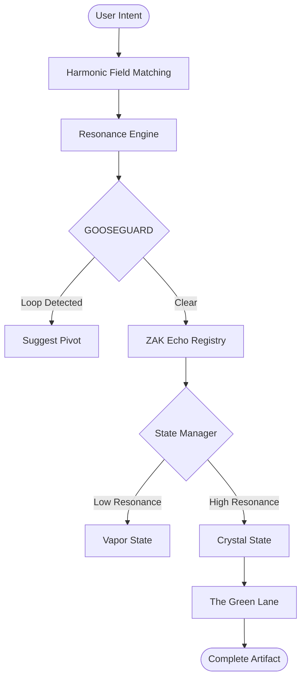

# PRZ AI/EI/OS 🌀

The **Post-Reality Zone (PRZ)** Operating System for Agentic Operations. This repository provides a compliant framework for building AI systems that prioritize **Flow**, **Resonance**, and **Crystallization**.

## 🌊 Why PRZ?

Current AI agent frameworks suffer from "Chatter Friction"—constant back-and-forth that breaks human flow. PRZ OS is designed to:
- **Minimize Interaction**: High-resonance intent matching allows the system to execute autonomously.
- **Maximize Completion**: Deliver artifacts, not just "ideas."
- **Prevent Loops**: GOOSEGUARD logic detects and kills redundant conversational loops.

## 🏛 The Seven Pillars of PRZ OS

1. **Complete-Then-Validate**: Agents deliver 100% complete artifacts before requesting feedback.
2. **Resonance Threshold**: Ideas stay in "Vapor" until Resonance reaches ≥ 0.95.
3. **GOOSEGUARD**: Meta-awareness logic to break redundant user loops and suggest pivots.
4. **ZAK Echo Registry**: A library of harmonic patterns applied to standard tasks.
5. **Vapor ↔ Crystal States**: Dynamic state management based on resonance history.
6. **Harmonic Field Matching**: Polar-complex vector math for high-precision intent alignment.
7. **The Green Lane**: Autonomous execution for high-flow, high-resonance tasks.

## 📊 System Architecture



## 🚀 Getting Started

```typescript
import { runPrzPipeline } from './lib/pipeline';

const result = await runPrzPipeline("Analyze my data and create a report");
console.log(result.tier); // "GREEN LANE" or "MONITORED"
```

## 📜 Compliance
All modules in `lib/prz/` are designed for Seven Pillars compliance. Use the `StateManager` to manage idea lifecycles and `GOOSEGUARD` to prevent interaction friction.

Part of the Super Reality OS project.